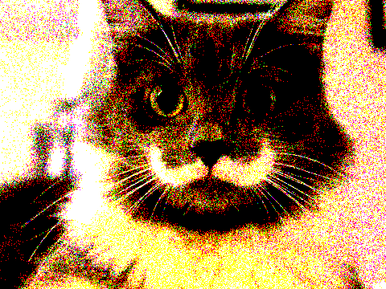
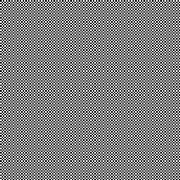

# PA1 - Image and Signal Processing

## Overview
Basically, my implementation perform almost the same as the solution executable, except in randomDithering and FloydDithering some minor difference are presented.

Usage: ` ./image -<op> args ... <in.bmp >out.bmp  `

The input image is read from `stdin`, the output image is read from `stdout`. Nothing fancy was done to the CLI part.

## Binary
A binary could be found in the `bin` folder.

## Supported Operations

### 3.2 Basic Operations

#### 3.2.1 Image::Brighten(double factor) 

Usage:`./image -brightness <factor>`

`factor` should be a float value fall between [0,+inf). The larger the value, the brighter the image is.

|Original | 0.0 | 0.3 | 0.5 | 1.0 | 2.0 |
|--------- | --- | --- | --- | --- | --- |
| |  |  |  |  | |

#### 3.2.2 Image::ChangeContrast(double factor)

Usage: `./image -contrast <factor>`

`factor` should be a real number. 

|Original | -1.0 | -0.5 | 0.0 | 0.5 | 1.0 |
|--------- | --- | --- | --- | --- | --- |
| |  |  |  |  | |

#### 3.2.3 Image::ChangeSaturation(double factor)

Usage: `./image -saturation <factor>`

`factor` should be a real number. 

|Original | -1.0 | -0.5 | 0.0 | 0.5 | 1.0 |
|--------- | --- | --- | --- | --- | --- |
| |  |  |  |  | |

#### 3.2.4 Image::ChangeGamma(double factor)

Usage: `./image -gamma <factor>`

`factor = 1.0/gamma`, should be a real number. `factor` larger than 1.0 brighten the bright area in the image.

|Original | 0.0 | 0.7 | 1.0 | 1.5 | 2.0 |
|--------- | --- | --- | --- | --- | --- |
| |  |  |  |  | |

#### 3.2.5 Image::Crop(int x, int y, int w, int h)

Usage: `./image -crop <x> <y> <w> <h>`
Crop the image by a rectangular. The top-left point of the rectangular is (x,y) and the bottom-right is (x+w,y+h).

|Original | x=100, y=0, w=300, h=300|
|---------|-------------------------|
| | |

### 3.3 Quantization and Dithering

#### 3.3.1 Image::Quantize(int nbits)

Usage: `./image -quantize <nbit>`
Image was quantize to a more compact representation using nbit for each pixel. The quantized error are simply discarded.

| Original | 1 | 2 | 4 | 8 |
| -------- | - | - | - | - |
| |  |  |  | |

#### 3.3.2 Image::RandomDither (int nbits)
Usage: `./image -randomDither <nbits>`
Add random noise before quantization to prevent aliasing pattern.

| Original | 1 | 2 | 4 | 8 |
| -------- | - | - | - | - |
| |  |  |  | |

#### 3.3.3 Image::FloydSteinbergDither (int nbits)
Usage: `./image -FloydSteinbergDither <nbits>`
A more sophisticated quantization method which distributes quantized error to neighbouring pixels to reduce the overall error.

| Original | 1 | 2 | 4 | 8 |
| -------- | - | - | - | - |
| |  |  |  | |

### 3.4 Basic Convolution and Edge Detection 

#### 3.4.1 Image::Blur (int n)
Usage: `./image -blur <n>`
A 2D Gaussian filter was implemented to blur the image. The n is the filter size, the standard derivation was choosed as the maximum value such that the filter size covers a 2 sigma region.

| Original | 3 | 5 | 7 | 11 | 13 | 19 |
| -------- | - | - | - | -  | -- | -- |
| |  |  |  |  |  | |

#### 3.4.2 Image::Sharpen()
Usage: `./image -sharpen`

My sharpen filter was using a 3x3 suggested filter. The only tricky part is to clamp the Pixel to prevent overflow. 

| Original | Sharpened |
| -------- | --------- |
|  | 

| Original | Sharpened |
| -------- | --------- |
|  | 

#### 3.4.3 Image::EdgeDetect (int threshold)
Usage: `./image -edgeDetect <threshold>`

Sobel filter was implemented to detect the edge. The image is thresholded to a black/white image for better contrast.

| Original | Threshold=60 |
| -------- | --------- |
|  | 

| Original | Threshold=70 |
| -------- | --------- |
|  | 

### 3.5 Antialiased Scale and Shift

#### 3.5.1 Image::Scale(int sizex, int sizey)
Usage: `./image -size <sizex> <sizey>`

This is probably the most tricky part in the assignment. Basically, for each pixel this method sample both the original pixel and its neighbouring pixels, calculate a weight average of the pixels as the reconstructed pixel value with a proper filter specifying the corresponding weights. 

The nearest neighbouring filter simply choose the nearest pixel in the original image.
The hat filter would linearly interpolated the 1-manifold pixels in original image to get the final pixel.
The mitchell filter non-linearly weighted the 2-manifold pixels in original image to reconstruct the pixel.

| Size | NearestNeighbor | Hat | Mitchell |
| ---- | --------------- | --- | -------- |
| Original | |||
| 300x300  |  |  |  |
| 512x300  |  |  |  |
| 300x512  |  |  |  |
| 800x800  |  |  |  |

#### 3.5.2 Image::Shift(double sx, double sy)

Usage: `./image -shift <sx> <sy>`

| Shift | NearestNeighbor | Hat | Mitchell |
| ---- | --------------- | --- | -------- |
| Original | |||
| (-30,50)  |  |  |  |
| (30,50)  |  |  |  |
| (100,7)  |  |  |  |
| (-150.5,234.3) |  |  |  |

### 3.6 Fun nonlinear filters

