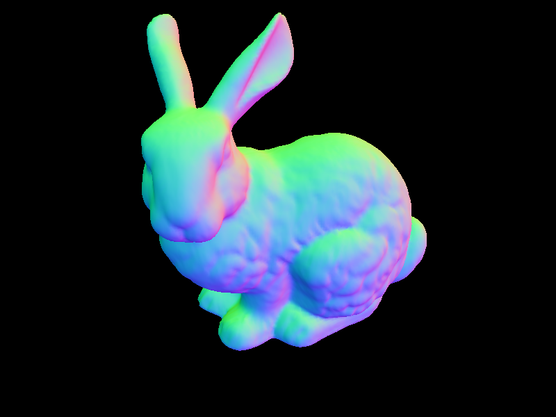
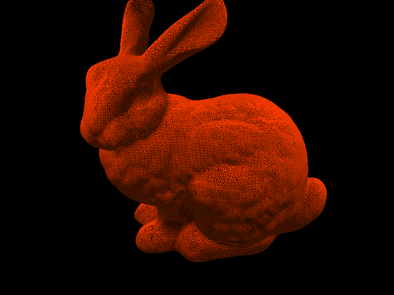
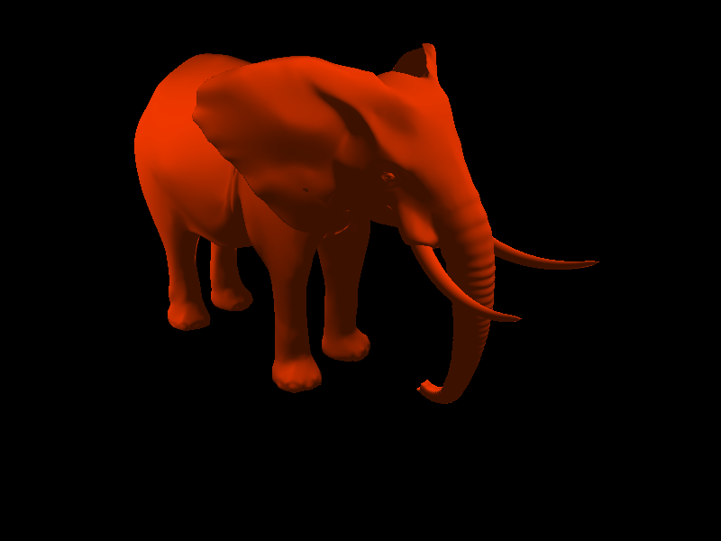
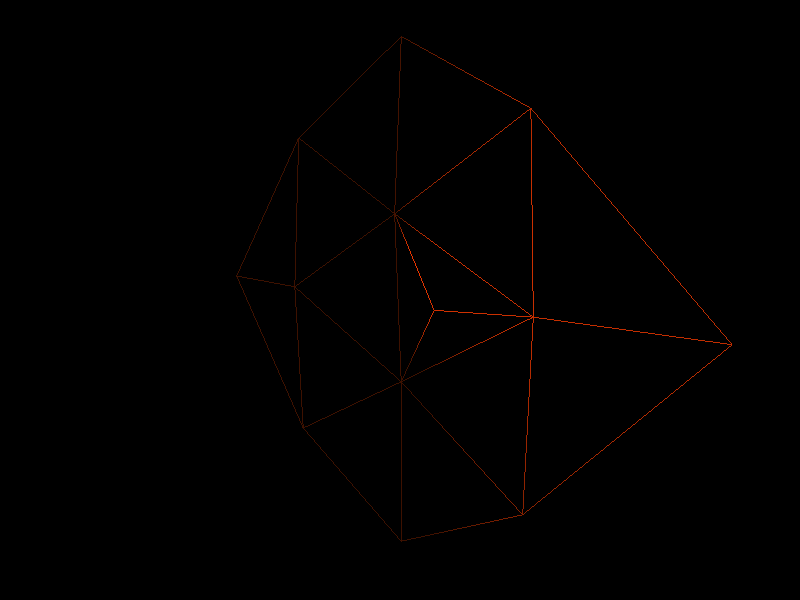

# PA2 - Geometric Modeling and Mesh Simplification

## Overview

In this homework, I built a Mesh Viewer using OpenGL and implemented the mesh simplification algorithm based on Quadric error metric paper. What we haven't really achieved is the Progressive Mesh part, since the current vertex split implementation still require intensive debugging.

## Binary
A binary could be found in the `bin` folder.

## DEMO

A demo link :

## External Library Used:
1. GLM(OpenGL Mathematics) 
2. C++ STL

## Implementation

### 1. Mesh Viewer

#### Basic Notes
Usage: ./viewer <op> <args>

Supported CLI Operation:
-help : display a simple help information
-sample : load a rectangular sample mesh
-model <filePath> : load OFF format model from given filePath
-edgeCollapse <v1> <v2> : Collapse vertex v1 and v2

Supported Operation in Viewer:
1. Mouse Left click could rotate the model
2. Mouse right click could change the camera view direction
3. UP/DOWN/LEFT/RIGHT could change the camera position
4. W key could enable/disable the wireframe display
5. N key could switch to the normal map shading / default Phong shading
6. Minus key and Equal key is used to manipulate the mesh simplification and progressive mesh

Screenshot:
| | | |
|----------------------------|--------------------------|------------------------------|
|| |  | 

#### Implementation Note

In order to debug and check the model simplification result, a mesh viewer is necessary. 

Basically, after I read in the OFF format data from file , the model center and bounding box of model could be determined. The model is translated to the world coordinate center and scaled to [-1,1] by the max dimension range by model matrix. The default camera is placed in (0,0,-5) and look at positive z axis direction. The view matrix is determined using Euler angle (since it is easy to implemented). The surface normal is calculated by taking the cross product of two edge vector of the mesh triangle, and the vertex normal is set to the average normal of all neighbouring surfaces.

### 2. Mesh Connectivity Data Structure

My mesh data structure is basically a augmented face index set. The vertex and face are stored in STL list to provided Sequential access ability when copying to OpenGL buffer. An additional Hashmap storing list iterator was kept for both vertex and face to provided random access according to their index. The delete is implemented as delayed delete mark and actual delete would be carried when copying to the rendering buffer. This redundant connectivity information provides O(1) access for neighbouring faces and vertex and also enable random access to face and vertex. The drawback of this data structure would be slower delete and update but since the update is not frequent and delete could be delayed. It's not a big performance issue so far.

The data structure is built in a straight forward way from OFF file. The vertex list and face list was first read in and then the adjacent faces field was set. The adjacent vertex is updated according to adjacent faces list. The reason I chose this data structure is that it's easy to implemented and provided satisfactory access time complexity for a lot of opertaions. The edge collapse could make use of the connectivity information to limit access to local vertices.  

##### Data members:
Vertex: Position, Normal, Pointer to adjacent Faces and Pointer to adjacent Vertex.
Face: Normal, Pointer to Vertex consisting the face.

### 3. Mesh Decimation

The edge collapse is implemented in that way:

Input : v1, v2

1. Transfer all adjacent faces of v2 to v1
2. Update connectivity information of vertices in all faces adjacent to v1.
3. Mark v2 as deleted
4. Remove faces adjacent to v1 which have two v1 id.
5. Remove faces adjacent to v1 which are identical to each other (Remove both) .

Sample:

| testpatch.off       |  Collapse v0 and v1    |
|---------------------| -----------------------|
||   |

