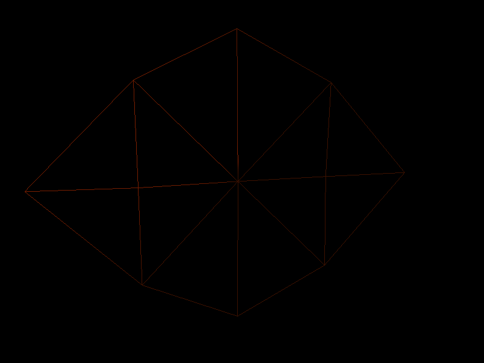

# PA2 - Geometric Modeling and Mesh Simplification

## Overview

In this homework, I built a Mesh Viewer using OpenGL and implemented the mesh simplification algorithm based on Quadric error metric paper. What we haven't really achieved is the Progressive Mesh part, since the current vertex split implementation still require intensive debugging.

## Binary
A binary could be found in the `bin` folder.

## DEMO

A demo link : 

## External Library Used:
1. GLM(OpenGL Mathematics) 
2. C++ STL

## Implementation

### 1. Mesh Viewer

#### Basic Notes
Usage: ./viewer <op> <args>

Supported CLI Operation:
-help : display a simple help information
-sample : load a rectangular sample mesh
-model <filePath> : load OFF format model from given filePath
-edgeCollapse <v1> <v2> : Collapse vertex v1 and v2

Supported Operation in Viewer:
1. Mouse Left click could rotate the model
2. Mouse right click could change the camera view direction
3. UP/DOWN/LEFT/RIGHT could change the camera position
4. W key could enable/disable the wireframe display
5. N key could switch to the normal map shading / default Phong shading
6. Minus key and Equal key is used to manipulate the mesh simplification and progressive mesh

Screenshot:

   

#### Implementation Note

In order to debug and check the model simplification result, a mesh viewer is necessary. 

Basically, after I read in the OFF format data from file , the model center and bounding box of model could be determined. The model is translated to the world coordinate center and scaled to [-1,1] by the max dimension range by model matrix. The default camera is placed in (0,0,-5) and look at positive z axis direction. The view matrix is determined using Euler angle (since it is easy to implemented). The surface normal is calculated by taking the cross product of two edge vector of the mesh triangle, and the vertex normal is set to the average normal of all neighbouring surfaces.

### 2. Mesh Connectivity Data Structure

My mesh data structure is basically a augmented face index set. The vertex and face are stored in STL list to provided Sequential access ability when copying to OpenGL buffer. An additional Hashmap storing list iterator was kept for both vertex and face to provided random access according to their index. The delete is implemented as delayed delete mark and actual delete could be carried when copying to the rendering buffer. This redundant connectivity information provides O(1) access for neighbouring faces and vertex and also enable random access to face and vertex. The drawback of this data structure would be slower delete and update but since the update is not frequent and delete could be delayed. It's not a big performance issue so far. Currently, the delete mark is not enforced to remove for better progressive mesh performance. 

The data structure is built in a straight forward way from OFF file. The vertex list and face list was first read in and then the adjacent faces field was set. The adjacent vertex is updated according to adjacent faces list. The reason I chose this data structure is that it's easy to implemented and provided satisfactory access time complexity for a lot of opertaions. The edge collapse could make use of the connectivity information to limit access to local vertices.  

##### Data members:
Vertex: Position, Normal, Pointer to adjacent Faces and Pointer to adjacent Vertex.

Face: Normal, Pointer to Vertex consisting the face.

### 3. Mesh Decimation

The edge collapse is implemented in that way:

Input : v1, v2

1. Transfer all adjacent faces of v2 to v1
2. Update connectivity information of vertices in all faces adjacent to v1.
3. Mark v2 as deleted
4. Remove faces adjacent to v1 which have two v1 id.
5. Remove faces adjacent to v1 which are identical to each other (Remove both) .

Sample:

| testpatch.off       |  Collapse v0 and v1    |
|---------------------| -----------------------|
||   |

| plane.off       |  Collapse v11 and v23    |
|---------------------| -----------------------|
||   |

(In plane.off test sample, the new point is placed in v11 original position.)

### 4. Quadric Simplification

Basically, the Quadric metric is a metric to greedly select best vertices pair to merge them. The Quadric metric is pretty simple in mathematic and the original paper state it quite clearly. It surely have limitation as refered in the paper, the summation may not be accurate in some geometry case but overall it works well.

The tricky part was to select the minimum quadric error pair in O(log(n)) time and also be able to update all pairs affected by the edge collapse in O(log(n)). Though the writeup suggest me to use Binary Search Tree to implmented the minimum query and update in O(log(n)) but I have no idea how this could be done in BST. 

Therefore, I used the minimum heap to implemented the minimum query in O(1). The minimum heap could be updated in O(log(n)) time if we used a Hashmap to keep track of the element position, update the value and swap up or down to maintain the heap property. However, since I'm using STL implementation of minimum heap, there are no swap up/down interface exposed to user. So I implemented it in another way. Instead of updating the value in the heap, I insert a new pairs with the latest quadric error into the minimum heap each time an update is needed. This could be guaranteed finished in O(log(n)) time. So the problem was to determine whether the top element is with the latest error. I attached a extra timestamp field to the heap element and redefine the order to be:

if(left.value==right.value){
	return left.timestamp>right.timestamp;
}
return left.error<right.error

Therefore with the same pair value, the latest timestamp would be guaranteed to be the top one. And the top() method was implemented to pick the top valid element(both vertices is valid).

Sample:

| teapot 500 face       |  teapot 100 face    |
|---------------------| -----------------------|
||   |

| torus 1000 face       |  torus 200 face    |
|---------------------| -----------------------|
||   |

| mug 500 face       |  mug 150 face    |
|---------------------| -----------------------|
||   |

### 5. Progressive meshes

This part is straight forward in idea. Basically, you need to record the collapsed edge and faces information in a stack, and applied the inversed procedure of edge collapse, which is called vertex split. I'm still debugging this part since vertex split need to use the recorded faces and vertices position which was removed and merged in the edge collapse procedure and it seems to be unstable with the STL container. 

My recorded information for edge collapse:
position of v1 and v2 ,the adjacent face set of v1 and v2.

My algorithm procedure was that:
1. Add new vertex with the position of previous v2.(This could utilize the delete mark feature by directly remove the delete mark)
2. Move v1 position to previous v1.
3. Remove all faces in adjacent face set of v2 but not in v1.
4. Restore adjacent face set to v2. (If there are vertex deleted, just remove the delete mark, the deleted vertex preserve the previous adjacent face set.)
5. Rebuild adjacent vertex set of v1 and v2.
